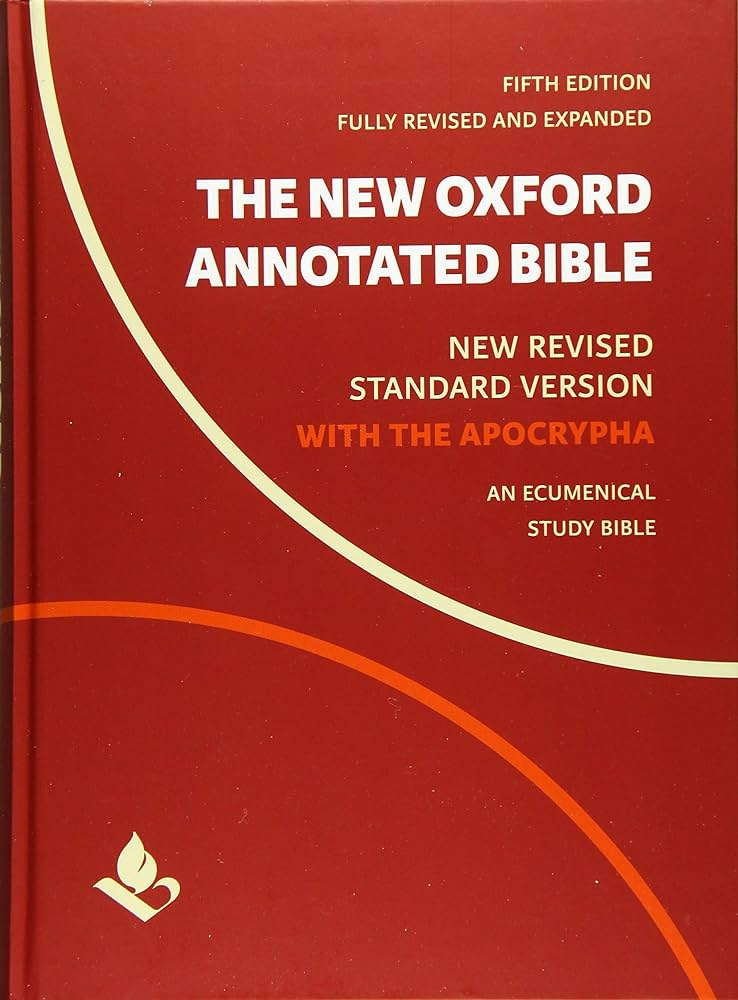

  

[**Download PDF**](./NRSV_New_Oxford_Annotated_Bible_with_Apocrypha.pdf)

> Recommended to read in two-column (two-page or landscape or horizontal) layout (orientation). Microsoft Edge web browser has this feature built-in, some other web browsers might too. See example why its useful and how to enable it in Edge in the image below.

Bible taken from [Internet Archive](https://archive.org/details/the-new-oxford-annotated-bible-with-apocrypha-new-revised-standard-version-2018/page/2165/mode/2up) ✝️💌🕊️ thank you guys, GOD bless you, may Jesus Christ our Holy Lord GOD Almighty continue guiding you and leading you and directing you into all Truth of Jesus Christ our Holy Lord GOD Almighty forevermore ✝️💌🤲